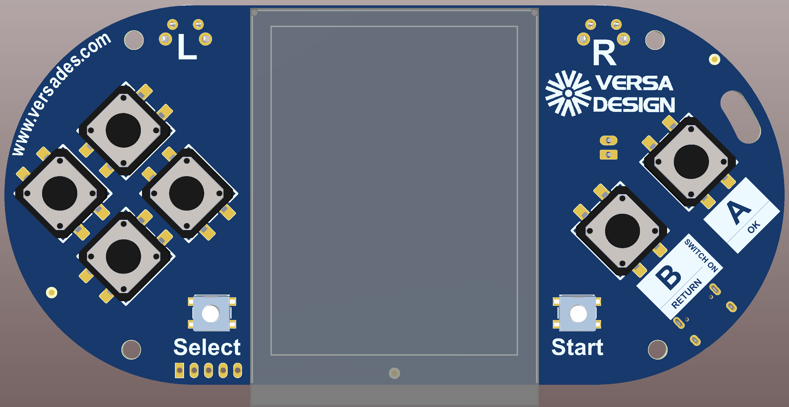
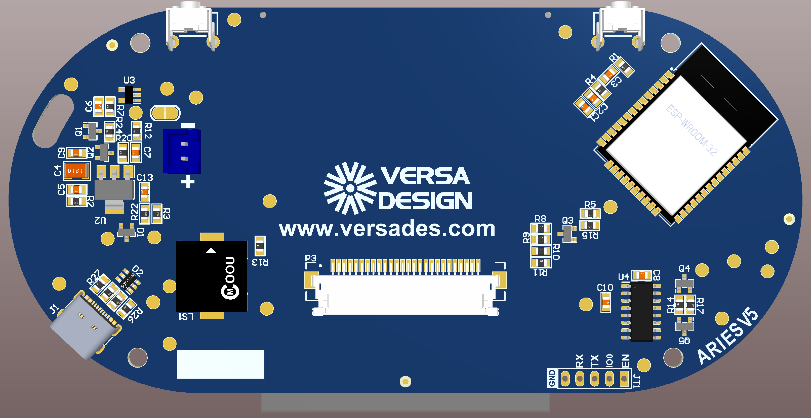

# Aries

  

  

El propósito de este repositorio es proporcinar soporte a los alumnos agraciados con una consola modelo *Aries*, entregada en la Universidad Politécnica de Valencia durante el foro de empleo celebrado el 17  y 18 de mayo de 2023.

Se incluyen carpetas con el siguiente contenido:
- *PCB*. Esquemático con el diseño de la placa y vista 3D en diversos formatos.
- [*Recovery*](Recovery/instrucciones.md). Incluye el firmware actual de la consola y todo lo necesario para programarlo.
- [*Versa_Sample*](Versa_Sample/instrucciones.md). Código de ejemplo para programar la placa.
***
## Información general

La consola *Aries* dispone de un [ESP32](https://www.espressif.com/en/products/socs/esp32) de [Espressif](https://www.espressif.com/) como microcontrolador. Se trata de un microcontrolador Xtensa LX6 de dos cores que pueden fucionar a un máximo de 240MHz.

En esta PCB se han integrado 10 botones, un buzzer, una pantalla de 240x320 píxeles y un programador FTDI conectado a un puerto USB.

Al conectar la consola al ordenador y encenderla, en el administrador de dispositivos deberá aparecer un nuevo puerto "COM" que será el mismo cada vez que se conecte la consola a partir de ese momento. Si se conecta un terminal como TeraTerm, o al trabajar desde el mismo [Visual Studio Code](https://code.visualstudio.com/), se podrá visualizar el texto que el programador introduzca con "printf".

Debido al sistema de carga se producen varios efectos a tener en cuenta durante el desarrollo:

- Para programar la placa es necesario mantener pulsado el botón rojo (B) durante la transferencia de los cuatro binarios.
- Con la consola apagada el puerto COM no aparece en el administrador de dispositivos, aun estando conectada al ordenador.
- Cuando el usuario termina la programación y suelta el botón, por un breve espacio de tiempo la terminal remota deja de estar disponible, y es muy probable que la información que genera el ESP32 durante el arranque no se vea. Sin embargo, la terminal es totalmente funcional y se puede utilizar "printf" para depurar el código.

La conexión por USB permite tanto programar el microcontrolador como cargar la batería. Es necesario tener en cuenta que el circuito de carga está preparado para utilizar sistemas de carga convencionales. Si el usuario utiliza un cargador de teléfono móvil de última generación con "Power Delivery" no podrá cargar la consola, ya que tanto el cargador como el circuito de carga entran en conflicto al determinar la energía que se tiene que transmitir. La siguiente versión de la consola dispondrá de un circuito de carga carente de dicha limitación.

Aunque los usuarios noveles suelen programar el ESP32 utilizando Arduino, para entornos profesionales se utiliza el SDK del fabricante, llamado IDF. En la carpeta [*Versa_Sample*](Versa_Sample/instrucciones.md) se incluyen instrucciones detalladas para preparar el entorno de desarrollo en [Visual Studio Code](https://code.visualstudio.com/).
***
## Acerca de

En Versa Design nos dedicamos al diseño y fabricación de electrónica desde el año 2008. A pesar de los años de crisis económica y las circunstancias atípicas de los últimos 15 años, Versa Design ha sido capaz de abrir un mercado propio, de clientes fieles y fiables, con un crecimiento orgánico sostenido, y una cuenta de resultados sólida. La reinversión de los beneficios en maquinaria y capital humano ha permitido dicho crecimiento, preservando la calidad y competitividad de nuestros productos, lo cual nos permite mirar al futuro con tranquilidad y optimismo.

La actividad de la empresa se subdivide entre I+D y producción. Nuestro equipo de ingeniería trabaja en los proyectos del mañana, mientras que producción fabrica los diseños de años anteriores conforme a las necesidades de nuestros clientes. Esta simbiosis entre diseño y producción es relativamente única en nuestra industria y nos hace especialmente idóneos para los proyectos de tamaño medio, cuyo volumen producción no justifica una deslocalización al sudeste asiático.

La calidad es otro de los ejes estratégicos de la empresa, por múltiples razones. No solo nos permite garantizar la satisfacción de nuestros clientes, sino que también nos hacer ser más rentables, gracias a unas tasas de fallo extremadamente reducidas, al alcance de muy pocas empresas. Versa Design está orgullosa no sólo de su certificación ISO 9001, sino también de haber recibido el visto bueno para el sector médico, especialmente exigente en este aspecto.

Todo ello es posible gracias al esfuerzo y desempeño de nuestro equipo humano, que constituye el auténtico capital de la empresa. Versa Design valora profundamente a sus empleados, y ha puesto en marcha un conjunto de medidas enfocadas a maximizar su satisfacción, nivel de vida y nivel de compromiso con la empresa.