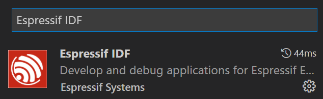
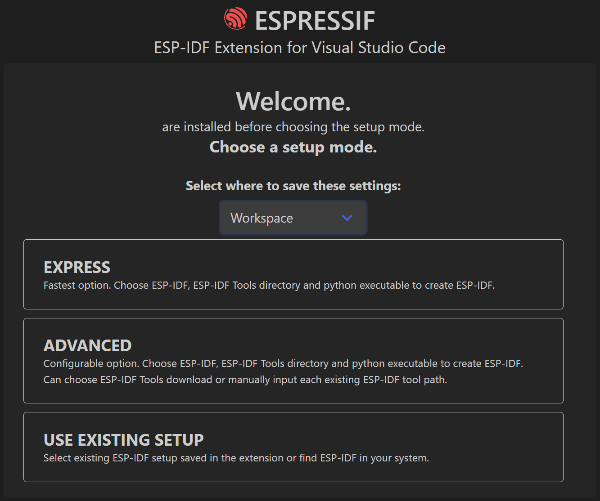
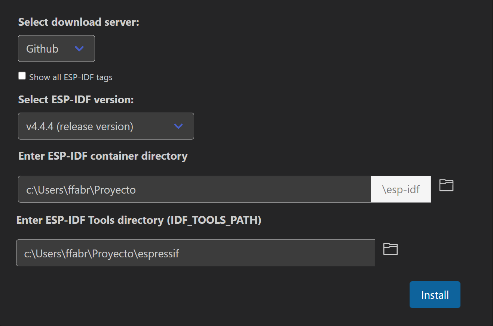
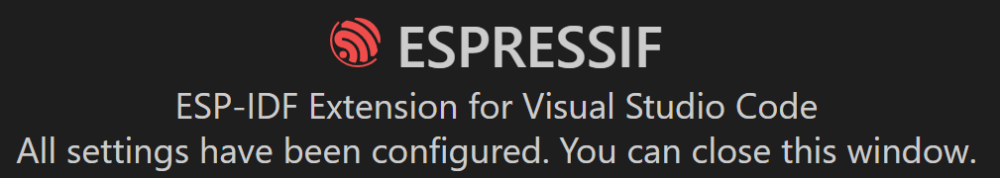
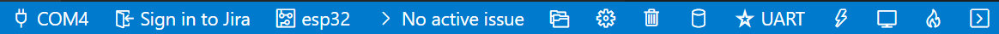
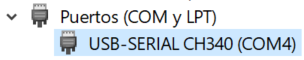
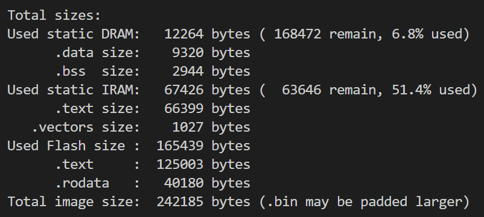

# Desarrollo en la consola *Aries*

En este documento se detalla el proceso a seguir para preparar el entorno de desarrollo para la consola *Aries*.

Esta carpeta aloja un código de ejemplo implementado para facilitar el desarrollo de nuevos proyectos. El código se ha desarrollado con la versión 4.4.4 del IDF, por lo que se recomienda utilizar esa misma versión durante el desarrollo de un nuevo proyecto.

***

## Instalación del entorno de desarrollo

El microcontrolador [ESP32](https://www.espressif.com/en/products/socs/esp32) ha sido diseñado por [Espressif](https://www.espressif.com/).

De momento, Espressif sugiere [en su página web](https://docs.espressif.com/projects/esp-idf/en/latest/esp32/get-started/index.html) dos entornos de desarrollo para sus proyectos:

- Eclipse. Mediante un [plugin](https://github.com/espressif/idf-eclipse-plugin/blob/master/README.md).
- Visual Studio Code. Mediante una extensión del programa.

El plugin de Eclipse es un desarrollo bastante reciente, por lo que se recomienda utilizar en su lugar VS Code con su extensión, ya que le han dado soporte desde hace bastante tiempo y su uso es bastante amigable.

### -Instalación de Visual Studio Code

La instalación de [Visual Studio Code](https://code.visualstudio.com/Download) es bastante sencilla y no requiere instrucciones detalladas.

### -Instalación de la extensión de Espressif

Una vez arrancado VS Code, al hacer clic en el icono con cuatro cuadrados en la barra vertical de la izquierda se entra en la lista de extensiones de VS Code:

  

Allí se debe buscar "Espressif IDF" para que aparezca la extensión a instalar:

  

Una vez instalada, cada vez que se abra un proyecto se detectará automáticamente si está ya configurado para compilar para un microcontrolador de Espressif. Si no es así, se abrirá un asistente para configurar el proyecto.

***

## Descarga del IDF

La compilación del proyecto requiere dos componentes:

- IDF. Se trata del SDK que incluye un conjunto de librerías considerablemente grande, que permite desarrollar código para el ESP32 y otros microcontroladores de Espressif. Por ejemplo, para conectar por WiFi a un servidor mediante WebSockets o el protocolo MQTT.
- Toolchain. Conjunto de herramientas necesarias para la compilación. Incluye un entorno local de Python utilizado por la extensión para la compilación y todo lo necesario para flashear el binario en el dispositivo.

En lo que respecta a la organización de carpetas se recomienda lo siguiente. Se crea una carpeta, por ejemplo "*Proyecto*", y dentro se incluye el proyecto descargado "*Versa_Sample*". Durante el proceso de instalación, junto a la carpeta anterior se crearán otras dos carpetas, una para el IDF y otro para el toolchain.

La extensión permite la descarga e instalación automática de ambos componentes.

Para este microcontrolador recomendamos utilizar la versión 4.4.4 de la  [API](https://docs.espressif.com/projects/esp-idf/en/v4.4.4/esp32/api-reference/index.html), y no la nueva versión 5.x, ya que esta última genera un código bastante más extenso, y dependiendo de las opciones habilitadas en el IDF podría ni si quiera compilar por falta de recursos en el microcontrolador.

Los proyectos de VS Code se abren haciendo doble clic sobre el fichero con extensión "*code-workspace*". En el código de ejemplo hay que abrir el fichero "*workspace.code-workspace*".

Lo más probable es que aparezca automáticamente el asistente ya mencionado. Si no es así, hay que pulsar *F1*, teclear "ESP-IDF: Configure ESP-IDF extension" y pulsar enter.

  

En la ventana anterior se debe seleccionar "*Workspace*" para que la configuración se guarde dentro del proyecto. Si se deja la opción "*Global*" los cambios se guardarán en la aplicación y se utilizarán para todos los proyectos de Espressif, y no se recomienda por si se desea utilizar distintas versiones de IDF para distintos proyectos.

No es necesario realizar una instalación avanzada, ni se desea utilizar un IDF ya existente, por lo que se seleccionará la primera opción "*EXPRESS*".

  

El siguiente paso consiste en seleccionar la versión del IDF, y por ende la versión de toolchain adecuado para ese IDF.

En la anterior ventana se selecciona la versión 4.4.4 (no se recomienda la 5.x para este microcontrolador).
Haciendo clic sobre el icono de carpeta en el lado derecho se selecciona la carpeta de la que cuelga el proyecto "*Versa_Sample*", en este ejemplo la carpeta "*Proyecto*". Durante el proceso se generará automáticamente una carpeta "*esp-idf*" donde se instalará el IDF.
Haciendo clic sobre el otro icono de carpeta se selecciona la misma carpeta, y luego es escribe en el campo editable "*\espressif*" para que el toolchain se instale en esa carpeta.

Por último se pulsa en el botón "*Install*".

El proceso tardará un rato, ya que se descarga el IDF, se instala, y por último se descargan e instalan cada uno de los componentes del "*toolchain*". En este último paso también se instala dentro del "*toolchain*" una versión portable de Python, y dentro de esta varios módulos.

Al terminar la instalación, la ventana deberá tener el siguiente aspecto:

  

En la carpeta principal de donde cuelgan el proyecto, el IDF y el *toolchain* habrá un fichero "*esp-idf-v4.4.4.zip*" que ya no se utilizará para nada. Se recomienda borrarlo para liberar espacio, ya que ocupa sobre 1GB.

Dentro de la carpeta "*esp-idf*" también hay una carpeta "*.git*" que se puede eliminar y pesa mucho. Esta carpeta se podría utilizar para cambiar de versión de IDF. Sin embargo, consideramos que no es una buena práctica, y si se desea cambiar de IDF lo mejor es borrar las carpetas del IDF y del *toolchain* y configurar de nuevo el proyecto. Después de eso, al iniciar la compilación aparecerá un error sin ninguna repercusión: *fatal: not a git repository (or any of the parent directories): .git*

***

## Primera compilación

En la parte inferior de la ventana de VS Code aparece una barra con el siguiente aspecto:

A continuación, se comentan con detalle los elementos más significativos:

- COM4. Es el puerto "COM" que se utilizará para flashear y mostrar el *output* de consola del dispositivo. Para determinar cuál es el puerto "COM" de la consola, hay que abrir el administrador de dispositivos, ir a la lista de puertos COM y encender la consola. Deberá aparecer un un puerto nuevo, tal y como se ve en la siguiente imagen:

  

- esp32. Aquí se indica cuál es el microcontrolador de Espressif para el cual queremos compilar. En nuestro caso es el esp32.
- Engranaje. Sirve para configurar el SDK, activando y desactivando componentes, tales como WiFi, Bluetooth, MQTT, etc. Al pulsar este botón aparece una ventana donde podemos modificar de forma gráfica el fichero "*sdkconfig*" que hay en la carpeta raíz del proyecto.
- Papelera. Hace un "*full clean*", es decir borra la carpeta "*build*" donde se compila el binario que se flashea en el dispositivo. Si se hacen cambios significativos en la estructura del proyecto, o para la compilación final, se recomienda limpiar y compilar todo de nuevo. De este modo, si hay ficheros ya compilados que contenían *warnings*, éstos aparecerán de nuevo y se tendrá otra oportunidad para corregirlos.
- Cilindro. Se utiliza para compilar el proyecto.
- UART. Especifica cómo se va a flashear el código, por UART o por JTAG. En la consola Aries será siempre por UART.
- Rayo. Flashea en el dispositivo el último binario compilado. Aun si se han hecho cambios en el código, estos cambios no se flashean sin antes compilar de nuevo.
- Monitor. Se conecta por UART al dispositivo y muestra el *output* que genera. Se puede utilizar *printf* en distintos puntos del código para tener *feedback* sobre el comportamiento del dispositivo.
- Llama. En un solo paso compila, flashea y monitoriza la salida del dispositivo. El botón preferido de todos.
- Consola. Abre una terminal donde carga el entorno IDF para poder ejecutar comandos IDF de forma manual. Se utiliza muy muy pocas veces.

Vamos a hacer la primera compilación. Del listado anterior, se deduce que hay que pulsar en el cilindro.

En una primera fase se analiza el fichero "*sdkconfig*" para determinar los elementos del IDF que se quieren incluir en la compilación. Cuando sale "-- *Configuring done*" termina el análisis y comienza la compilación.

Se compila tanto el bootloader como la aplicación principal. El ESP32 tiene bootloader porque se puede tener en la flash varias particiones para actualizar el dispositivo.

La primera compilación tarda bastante porque ha de compilar más de 1000 ficheros. Al final, deberá salir un listado como el siguiente:

  

En él se indica la RAM ocupada de forma estática (sin tener en cuenta memoria dinámica ni stack), la RAM estática dedicada a instrucciones (necesaria para acelerar algunas tareas críticas) y la cantidad de flash necesaria para guardar el firmware.

A partir de este momento, es posible que aparezca un *popup* preguntando si se quiere utilizar el fichero "*compile_commands.json*" para ayudar a *Intellisense* a detectar errores de compilación. Cuando eso suceda hay que decir que sí.

Tras terminar la compilación, si se pulsa sobre el rayo se flashea el firmware en la consola. Como ya se ha indicado en el fichero "*README.md*", es necesario mantener pulsado el botón rojo (B) durante la grabación de los binarios.

En pantalla aparecerán varios cuadrados en gris que reaccionan a la pulsación de las teclas correspondientes. Los botones "*Select*" y "*Start*" sirven para apagar la consola.

***

## Estructura de un proyecto

La carpeta raíz del proyecto tiene la siguiente estructura:

- *.vscode*. Carpeta generada automáticamente por VS Code y la extensión de Espressif.
- *components*. Componentes creados por el usuario.
- *main*. Carpeta principal del proyecto.
- *CMakeLists.txt*. Fichero utilizado por CMake para la compilación.
- *ota_ptable.cvs*. Definición con las particiones que habrá en la flash.
- *sdkconfig*. Fichero de configuración de IDF. No editarlo manualmente.
- *version.txt*. Versión de firmware utilizada internamente por el IDF.
- *workspace.code-workspace*. Fichero que se utiliza para abrir el proyecto, y donde se guarda la configuración del IDF si se han seguido los pasos correctamente.

Espressif ha organizado en "componentes" los distintos elementos que se pueden utilizar para desarrollar un firmware.

En la carpeta "esp-idf\components" está la lista completa de componentes desarrollados por el fabricante. En la carpeta "esp-idf\examples" hay ejemplos sobre cómo utilizar la mayoría de ellos.

***

## Contenido del código de ejemplo

Si en el proyecto se crea una carpeta "*components", el IDF trata lo que se ponga dentro igual que como procesa los componentes predeterminados.

En este proyecto se han creado tres componentes:

- *buzzer*. Utilizado para hacer vibrar al *buzzer* a una determinada frecuencia.
- *matrix_keypad*. Utilizado para gestionar las pulsaciones de teclas.
- *screen*. Utilizado para gestionar la retroiluminación de la pantalla.

Hemos incluido estos tres commponentes por estar íntimamente relacionados con el hardware de la consola.

En cada componente hay un fichero "*CMakeLists.txt*" donde se declaran los ficheros a compilar, las carpetas donde hay ficheros ".h" y la lista de otros componentes que hacen falta para compilar este componente en concreto.

La carpeta "*main* contiene el código de ejemplo:

- *global.h*. Definiciones generales utilizadas en todo el código.
- *hwplatform.h/c*. Funciones de acceso al hardware.
- *main.c*. Punto de entrada a la aplicación.
- *pcbdefs.h*. Definición de pines de esta PCB en concreto.
- *scr_main.h/c*. Función que gestiona el contenido que se dibuja en la pantalla.
- *sound.h/c*. Funciones utilizadas para reproducir sonidos.
- *sysTick.h/c*. Tick del sistema utilizado para realizar tareas periódicas.
- *task_ui.h/c*. Tarea de FreeRTOS utilizada para gestionar eventos de pantalla y teclado.
- *tftdriver.h/c*. Funciones utilizadas para gestionar el dibujado en la pantalla.

Si se observa el código incluido en el fichero "*scr_main.c", cada vez que se pulsa "*Select*" o "*Start*" se pone la pantalla en negro, se quita la alimentación y se espera a que ésta se vaya, dando tiempo a la pantalla para redibujarse. Si se pulsa cualquier otra tecla se dibuja un cuadrado en verde y se redibujan los cuadrados del resto de teclas en gris.

Este punto de partida permitirá a cualquier programador desarrollar algún juego o aplicación. Os animamos a utilizar este código de base para desarrollar vuestras propias ideas, incluiso añadiendo nuevas funcionalidades a partir de los componentes proporcionados por Espressif.